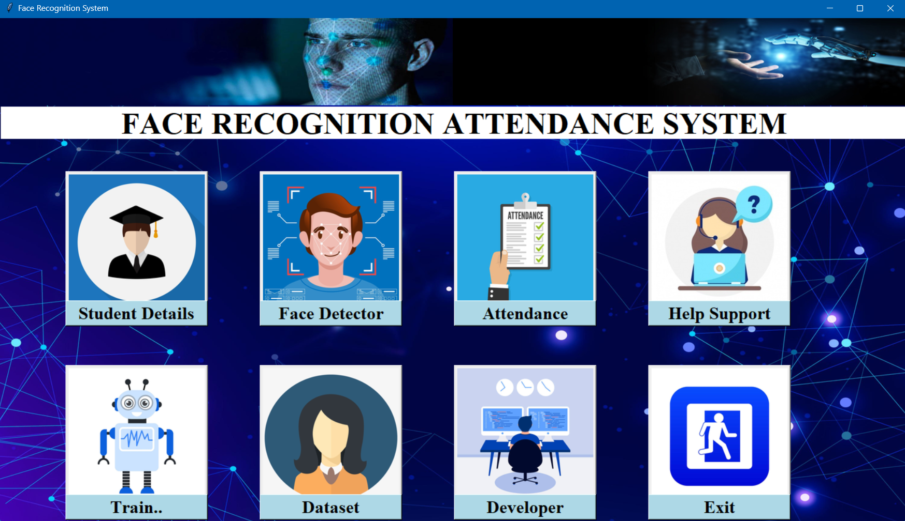
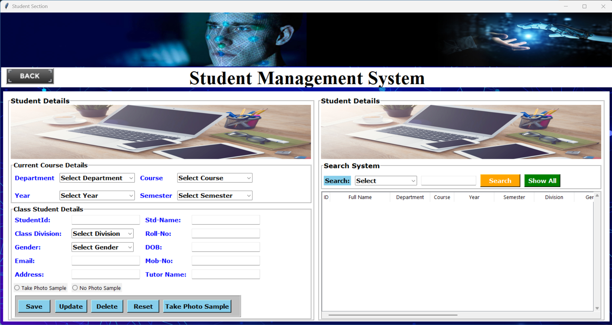
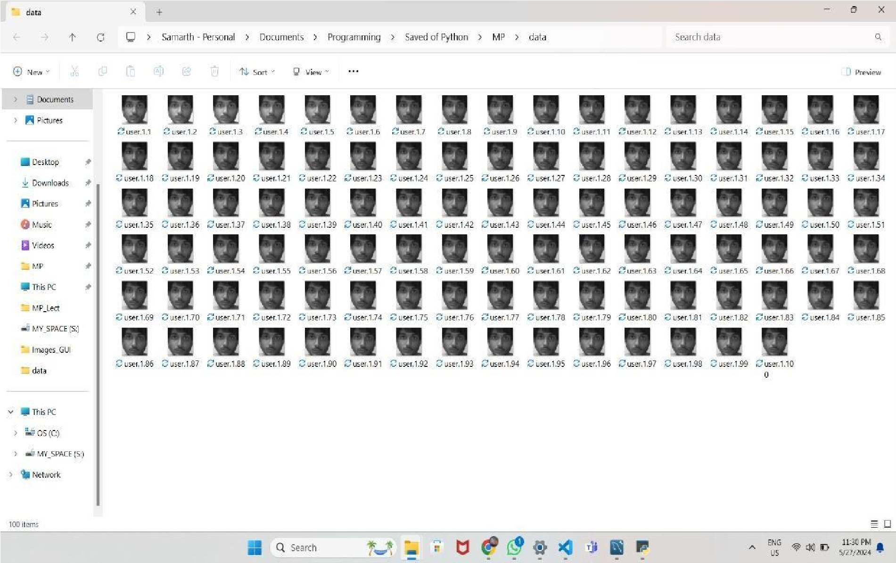
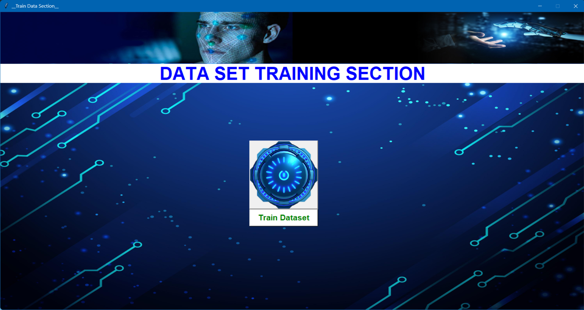
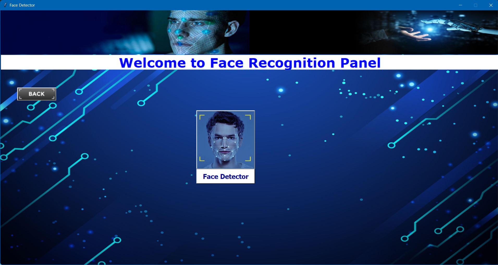
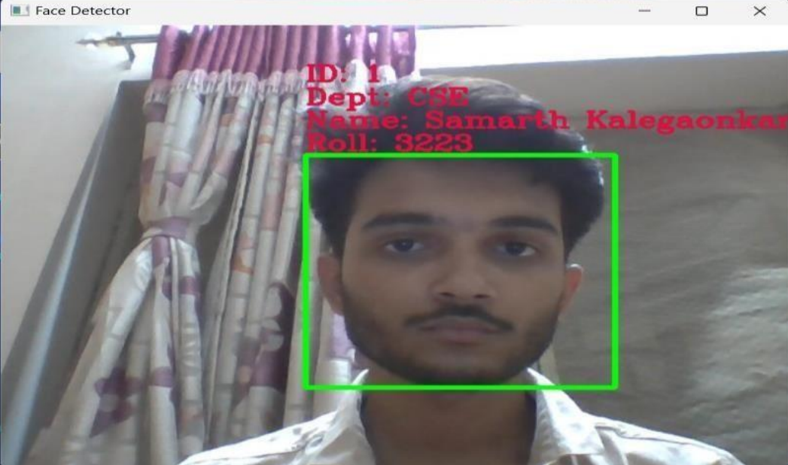

# 🎯 Face Recognition Attendance System


An automated attendance system powered by real-time face recognition using Python, OpenCV, and the `face_recognition` library. Say goodbye to manual attendance—this system recognizes faces from a live camera feed and logs attendance with accurate timestamps. 🚀

---

## 🔧 Features

- 👁️‍🗨️ Real-time face detection and recognition  
- 📋 Automatic attendance marking with timestamps  
- 🗃️ Data storage in CSV (or SQLite optional)  
- 🧠 Built using deep learning-based facial recognition  
- 🖥️ Optional GUI with Tkinter or Web UI with Flask/Django  
- 🛡️ Duplicate entry prevention per session  

---

## 📷 Screenshots

| Page | Screenshot |
|------|------------|
| **Login Page** |  |
| **Register Page** |  |
| **Main Page** |  |
| **Student Page** |  |
| **Dataset** |  |
| **Training Dataset Page** |  |
| **Face Detection Page** |  |
| **Output** |  |
| **Developer Page** |  |

> 📝 Replace the image names above if your actual files are named differently or use `.jpg`/`.jpeg` extensions.

---

## 📂 Project Structure

```
Facial-Recognition-Attendance-System
   ├─ atd.csv
   ├─ attendance.csv
   ├─ attendance.py
   ├─ classifier.xml
   ├─ data
   ├─ Detect.py
   ├─ developer.py
   ├─ face.jpg
   ├─ face_recognition.py
   ├─ haarcascade_frontalface_default.xml
   ├─ helpsupport.py
   ├─ Images_GUI
   ├─ known_faces
   ├─ login.py
   ├─ main.pyx
   ├─ README.md
   ├─ register.py
   ├─ req.txt
   ├─ student.py
   ├─ train.py
   └─ __pycache__
```

---

## ⚙️ How It Works

1. **Register Faces**: Add known face images to the `dataset/` folder (name files like `John_Doe.jpg`).
2. **Run the Script**: Launch `main.py` to start the camera.
3. **Live Recognition**: The system matches detected faces with stored encodings.
4. **Attendance Log**: When a match is found, the system logs the name and time in `attendance.csv`.

---

## 🧠 Algorithms Used

- **Haar Cascade Classifier** for real-time face detection.
- **LBPH Face Recognizer** for effective face recognition.

---

## 🚀 Getting Started

### 🔗 Clone the Repository

```bash
git clone https://github.com/yourusername/face-recognition-attendance.git
cd face-recognition-attendance
```

### 📦 Install Dependencies

```bash
pip install -r requirements.txt
```

### ▶️ Run the Application

```bash
python main.py
```

---

## ✅ Requirements

- Python 3.6+
- OpenCV
- `face_recognition` (built on dlib)
- NumPy
- Pandas

Install them using:

```bash
pip install opencv-python face_recognition numpy pandas
```

---

## 💡 Future Enhancements

- 📱 Web-based dashboard for reports  
- 📧 Email notifications  
- 🧑‍💼 Admin authentication  
- ☁️ Cloud storage integration  

---

## 📜 License

This project is licensed under the MIT License - see the [LICENSE](LICENSE) file for details.

---

## 🙌 Acknowledgements

- [OpenCV](https://opencv.org/)  
- [face_recognition](https://github.com/ageitgey/face_recognition)  
- [Dlib](http://dlib.net/)  

---

## 💬 Feedback & Contributions

Pull requests are welcome! For major changes, please open an issue first to discuss what you'd like to change.  
If you found this project helpful, consider giving it a ⭐️!

---
